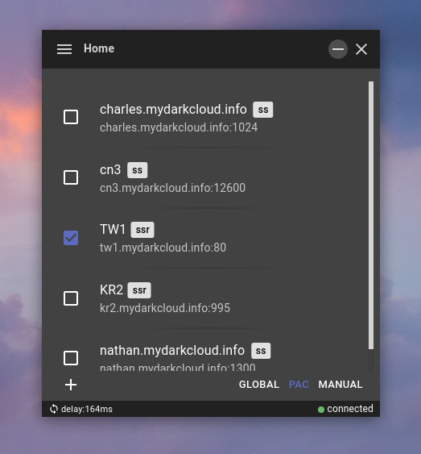
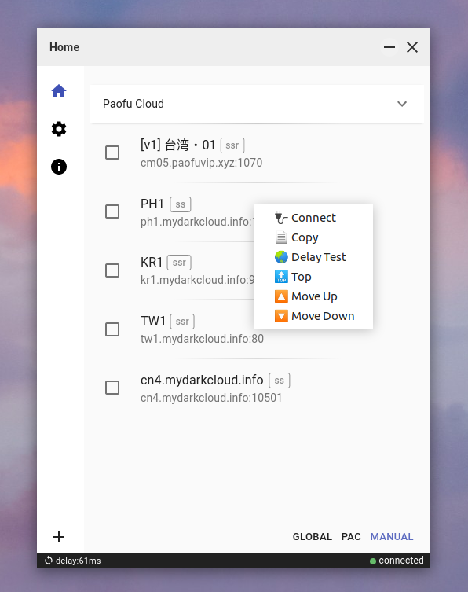

[](https://github.com/nojsja/shadowsocks-electron/actions/workflows/publish.yml)   

 

```txt

███████╗██╗  ██╗ █████╗ ██████╗  ██████╗ ██╗    ██╗███████╗ ██████╗  ██████╗██╗  ██╗███████╗      ███████╗██╗     ███████╗ ██████╗████████╗██████╗  ██████╗ ███╗   ██╗
██╔════╝██║  ██║██╔══██╗██╔══██╗██╔═══██╗██║    ██║██╔════╝██╔═══██╗██╔════╝██║ ██╔╝██╔════╝      ██╔════╝██║     ██╔════╝██╔════╝╚══██╔══╝██╔══██╗██╔═══██╗████╗  ██║
███████╗███████║███████║██║  ██║██║   ██║██║ █╗ ██║███████╗██║   ██║██║     █████╔╝ ███████╗█████╗█████╗  ██║     █████╗  ██║        ██║   ████****██╔╝██║   ██║██╔██╗ ██║
╚════██║██╔══██║██╔══██║██║  ██║██║   ██║██║███╗██║╚════██║██║   ██║██║     ██╔═██╗ ╚════██║╚════╝██╔══╝  ██║     ██╔══╝  ██║        ██║   ██╔══██╗██║   ██║██║╚****██╗██║
███████║██║  ██║██║  ██║██████╔╝╚██████╔╝╚███╔███╔╝███████║╚██████╔╝╚██████╗██║  ██╗███████║      ███████╗███████╗███████╗╚██████╗   ██║   ██║  ██║╚██████╔╝██║ ╚████║
╚══════╝╚═╝  ╚═╝╚═╝  ╚═╝╚═════╝  ╚═════╝  ╚══╝╚══╝ ╚══════╝ ╚═════╝  ╚═════╝╚═╝  ╚═╝╚══════╝      ╚══════╝╚══════╝╚══════╝ ╚═════╝   ╚═╝   ╚═╝  ╚═╝ ╚═════╝ ╚═╝  ╚═══╝
```

[● Telegram Channel](https://t.me/shadowsocks_electron)

## I. Shadowsocks Electron

Shadowsocks GUI client with cross-platform desktop support powered by Electron⚛️, made specially for Linux / Windows users.

### ➣ Tested on:

- Ubuntu20.4/21.04/22.04 (amd64)
- Ubuntu22.10 (arm64)
- MacOS Catalina (x64)
- MacOS Monterey (arm64/x64)
- Windows10/11 (x64)

### ➣ Future test plan

- Linux Kali/Manjaro (x64)
- Windows7/8 (x64/arm64)
- MacOS Big Sur/Mojave (x64/arm64)

## II. Features

### ➣ Supported

- __SS / SSR__ Protocol
- __PAC__ Mode
  - Auto proxy mode for browser that use [GFWList](https://raw.githubusercontent.com/gfwlist/gfwlist/master/gfwlist.txt) as default rules.
  - Allow custom rules.
- __Global__ Mode
  - Global socks5 proxy for browser.
- __Manual__ Mode
  - Get some tools like SwitchOmega to enable browser proxy on this mode.
- __HTTP(S)__ Proxy
  - On Windows, commands for terminal proxy(port 1095 as default):
    - `$env:HTTPS_PROXY="http://127.0.0.1:1095"` (powershell)
    - `$env:HTTP_PROXY="http://127.0.0.1:1095"` (powershell)
    - `set http_proxy=http://127.0.0.1:1095` (cmd)
    - `set https_proxy=http://127.0.0.1:1095` (cmd)
  - On Linux/MacOS, commands for terminal proxy:
    - `export http_proxy="127.0.0.1:1095"`
    - `export https_proxy="127.0.0.1:1095"`
    - Some tools like `proxychains` is deep recommended.
- ACL (access control list)
- Nodes Load-Balancing Mode
- Clipboard / QR-code Import
- Subscription Import
- Language Detecting And Switching (zh-CN / en-US / ru-RU)
- Configuration Backup / Recovery
- Dark / Light Mode
- Auto Start
- Server Share
- Activity Logs
- [Process Manager](https://github.com/nojsja/electron-re)

### ➣ In Testing

- AEAD ciphers
- SIP003 plugins (v2ray-plugin,kcptun and more)

### ➣ Comming Soon

- Tunnel Mode

## III. Problems

- QRCode-Import may not work on some devices.
- Linux without Gnome-desktop may not work, working for that.
- Snap package for Linux has some abnormal behavior.

## IV. Supported Platforms & Arch


> More architectures will be supported if necessary, just give me an issue.

- Ubuntu
  - deb `x64/x86/arm64`
  - AppImage `x64/x86/arm64`
  - snap `x64`
- MacOS
  - dmg `x64/arm64`
  - zip `x64/arm64`
- Windows
  - exe `x64/x86`
  - zip `x64/x86`

## V. Screenshots

### Home Page


### Dark Mode



### Fixed Menu


### Server Add


### Context Menu



### Server Edit


### Server Share


## VI. Downloads

- GitHub Releases
  - 
  - [↪ releases page ](https://github.com/nojsja/shadowsocks-electron/releases/latest)

- ElectronJs Website
  - [↪ home page ](https://www.electronjs.org/apps/shadowsocks-electron)

- Snapcraft Store (linux)
  - [](https://snapcraft.io/shadowsocks-electron)
  - [↪ home page ](https://snapcraft.io/shadowsocks-electron)

## VII. Plugins Downloads
> not necessary, just for some advanced users.

- __kcptun__
  - effect: Use the plugin for ss server speed up. You must install it on you system first and enable it on ss server configuration.
  - [↪ kcptun repo releases](https://github.com/shadowsocks/kcptun/releases/)
  - install: Download a certain version plugin, unpack and rename it to `kcptun`, then put the file into system dir (such as `/usr/bin/`) on unix like systems. OR you may put the file into `plugins dir` on Windows (check "Open Plugins Directory" button from settings page).

- __v2ray-plugin__
  - effect: Use the plugin for traffic obfuscation. You must install it on you system first and enable it on ss server configuration.
  - [↪ v2ray-plugin repo releases](https://github.com/nojsja/v2ray-plugin/releases)
  - install: Download a certain version plugin, unpack and rename it to  `v2ray-plugin`, then put the file into system dir (such as `/usr/bin/`) on unix like systems. OR you may put the file into `plugins dir` on Windows (check "Open Plugins Directory" button from settings page).

## VIII. Recommended ACL Files

**1. Download ACL file and saved it to local directory.**

[>> Github repo - SuperAcl](https://github.com/Windelight/SuperACL.git)
- [inchina.acl](https://raw.githubusercontent.com/Windelight/SuperACL/master/inchina.acl): Proxy only sites blocked by the firewall.
- [inforeign.acl](https://raw.githubusercontent.com/Windelight/SuperACL/master/inforeign.acl): Proxy the sites in china which restricted access to overseas.

**2. Enable ACL Mode and load the file on settings page of client.**

## IX. Why?

- The official qt-version app - [`shadowsocks-qt5`](https://github.com/shadowsocks/shadowsocks-qt5) has been deprecated, which has an old interface but still working.
- Only [`Shadowsocks-libev`](https://github.com/shadowsocks/shadowsocks-libev) and [`Shadowsocks for Android`](https://github.com/shadowsocks/shadowsocks-android) support ACL (bypass China IPs, etc.)

 This project was heavily inspired by [shadowsocks/ShadowsocksX-NG](https://github.com/shadowsocks/ShadowsocksX-NG), which uses local Shadowsocks-libev binary to avoid complex integration with native C code. This means it can always use the latest Shadowsocks-libev version.

It also uses Electron to bring the most powerful cross-platform desktop support with great developing experience.

## X. Development

### 1. Env

- Node@^`14.18`
- Ubuntu18.04 or higher version
- Mac catalina or other versions (works in most recent versions in theory)
- Windows 10 or higher version

### 2. Prepare

> The step is not necessary, there are some buildin `ssr/ss` executable files provided in bin dir, Only do this when you want to use external bin for test/dev.

- __Mac__ developers need to install `shadowsocks-libev` at first, use command here: `brew install shadowsocks-libev`. For china users, if brew is not installed, run this in terminal: `/bin/zsh -c "$(curl -fsSL https://gitee.com/cunkai/HomebrewCN/raw/master/Homebrew.sh)"` to install brew.
- __Ubuntu__ developers can install `shadowsocks-libev` with apt manager.

```bash
# for ubuntu developers
$: sudo apt install shadowsocks-libev
$: sudo snap install multipass
# for mac developers
$: brew install shadowsocks-libev

# proxy env set (if your local machine support)
export HTTPS_PROXY=http://127.0.0.1:<port>
export HTTP_PROXY=http://127.0.0.1:<port>
```

### 3. Run commands in terminal

```bash
# [01]clone
$: git clone https://github.com/nojsja/shadowsocks-electron.git
$: cd shadowsocks-electron

# for china developers
$: npm config set electron_mirror http://npm.taobao.org/mirrors/electron/

# [02]npm
$: npm i -g yarn
$: npm i

# [03]run scripts/download.js for env prepare
$: cd scripts
$: node download.js

# for ubuntu developers
$: cp pac/gfwlist.txt ~/.config/shadowsocks-electron/pac/
# for mac developers
$: cp pac/gfwlist.txt ~/Library/Application\ Support/shadowsocks-electron/pac/

# [04]start
$: npm start
```

## XI. Mention

> The repo is cloned from `robertying/shadowsocks-electron` which is no longer maintained. I create a new repo based on that in order to be found in github search list.

## XII. Credit

- [tindy2013/shadowsocks-static-binaries](https://github.com/tindy2013/shadowsocks-static-binaries)
- [robertying/shadowsocks-electron](https://github.com/robertying/shadowsocks-electron)
- [shadowsocks/shadowsocks-libev](https://github.com/shadowsocks/shadowsocks-libev)
- [shadowsocks/ShadowsocksX-NG](https://github.com/shadowsocks/ShadowsocksX-NG)
