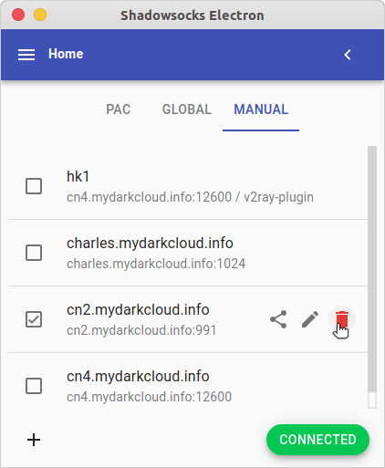
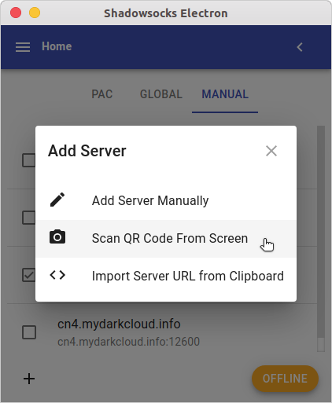
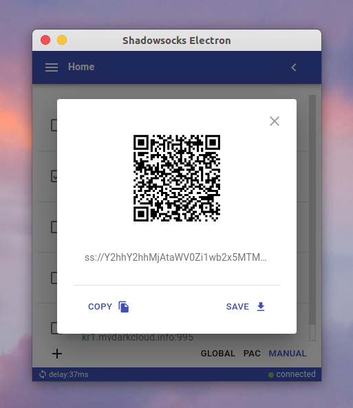
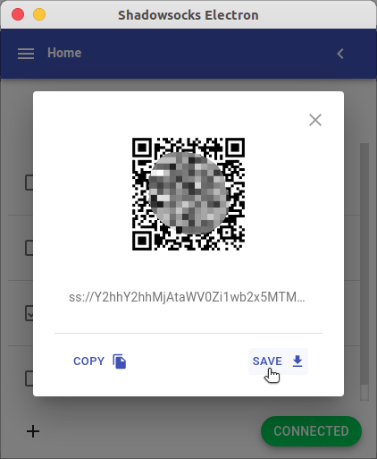
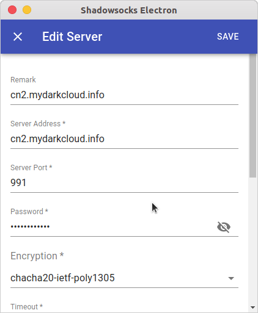

# Shadowsocks Electron

> Test on Ubuntu20.4.3 (amd64) and MacOS catalina (x64)

> The repo is cloned from `robertying/shadowsocks-electron` which is no longer maintained. I create a new repo based on that in order to be found in github search list.

Shadowsocks GUI with cross-platform desktop support based on Electron⚛️, made specially for Linux/Mac users.

## Screenshots











## Downloads

- GitHub Releases

  [download](https://github.com/nojsja/shadowsocks-electron/releases/latest)

## Why?

- The official qt-version application - [`shadowsocks-qt5`](https://github.com/shadowsocks/shadowsocks-qt5) has been deprecated, which has a really old interface but function is still ok.
- Only [`Shadowsocks-libev`](https://github.com/shadowsocks/shadowsocks-libev) and [`Shadowsocks for Android`](https://github.com/shadowsocks/shadowsocks-android) support ACL (bypass China IPs, etc.)

 This project was heavily inspired by [shadowsocks/ShadowsocksX-NG](https://github.com/shadowsocks/ShadowsocksX-NG), which uses local Shadowsocks-libev binary to avoid complex integration with native C code. This means it can always use the latest Shadowsocks-libev version.

It also uses Electron to bring the most powerful cross-platform desktop support with great developing experience.

## Features

> Supported

- PAC mode (GFWList)
- Global mode (socks proxy)
- Manual mode (no system-wide proxy set)
- Clipboard import
- QR code scan import
- Language switching (zh-CN/en-US only)
- Configuration backup / recovery
- Auto start on boot
- Server sharing
- Application logs
- Application process manager

> In Testing

- AEAD ciphers
- SIP003 plugins (v2ray & kcptun)

> Coming Soon
- HTTP(s) proxy
- SSR
- ACL
- VMess(v2ray protocol)

## Development

>Please confirm the node version is not lower than `14.18`.

### 1. Prepare

- __Mac__ developers need to install `shadowsocks-libev` at first, use command here: `brew install shadowsocks-libev`. For china users, if brew is not installed, run this in terminal: `/bin/zsh -c "$(curl -fsSL https://gitee.com/cunkai/HomebrewCN/raw/master/Homebrew.sh)"` to install brew.
- __Ubuntu__ developers can install `shadowsocks-libev` with apt manager.

```bash
# for ubuntu developers
$: sudo apt install shadowsocks-libev
# for mac developers
$: brew install shadowsocks-libev
```

### 2. Run commands in terminal

```bash
# [01]clone
$: git clone https://github.com/nojsja/shadowsocks-electron.git
$: cd shadowsocks-electron

# for china developers
$: npm config set electron_custom_dir "13.4.0"
$: npm config set electron_mirror http://npm.taobao.org/mirrors/electron/

# [02]npm
$: npm i -g yarn
$: npm i

# [03]run scripts/download.js for env prepare
$: cd scripts
$: node download.js

# for ubuntu developers
$: cp pac/gfwlist.txt ~/.config/shadowsocks-electron/pac/
# for mac developers
$: cp pac/gfwlist.txt ~/Library/Application\ Support/shadowsocks-electron/pac/

# [04]start
$: npm start
```

## Supported Platforms

- Ubuntu (linux x64)
- MacOS (darwin x64)
- <del>Windows (windows x64)</del>

## Credit

- [robertying/shadowsocks-electron](https://github.com/robertying/shadowsocks-electron)
- [shadowsocks/shadowsocks-libev](https://github.com/shadowsocks/shadowsocks-libev)
- [shadowsocks/ShadowsocksX-NG](https://github.com/shadowsocks/ShadowsocksX-NG)
- [himanshub16/ProxyMan](https://github.com/himanshub16/ProxyMan)
